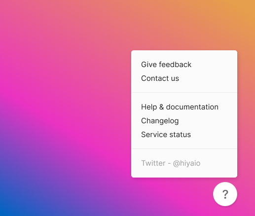

<div style="height:100px"></div>

# About Foyer

Foyer is a widget that lives in the bottom corner of your site, helping users find information and support in an unobtrusive way.

Foyer has been designed for [Hiya](https://hiya.io) to improve the logged-in customer experience and has now been opened up for broader use.



## Foyer in action

Here's a demo: **[foyer.hiya.io](https://foyer.hiya.io/)**

## Add Foyer to your site

To add Foyer to your site:

```html
<script src="https://unpkg.com/@hiyaio/foyer/foyer.js"></script>
<script>
  foyer.init({
    sections: [
      {
        label: "Help & support",
        href: "https://github.com/hiyaio/foyer.js/issues",
      },
    ],
  });
</script>
```

More examples of how you can configure Foyer can be found in [/demo](/demo).

## Tasks

- [x] Add hosted demo page
- [ ] Add multi-section (groups) support
- [ ] Add custom event trigger support for section items
- [ ] Add full options documentation to Readme
- [ ] ECMAScript module import support

## Developing locally

Looking to develop Foyer for contributing/forking, great! Just run:

```
yarn start
```

This should build and run a demo environment for you to test on http://localhost:1234/.

### Credits

- Logo graphic: [Reception by Tomi Triyana](https://thenounproject.com/icon/reception-3177734/)
- Screenshot background image: [Planet Volumes](https://unsplash.com/fr/@planetvolumes?utm_source=unsplash&utm_medium=referral&utm_content=creditCopyText)
