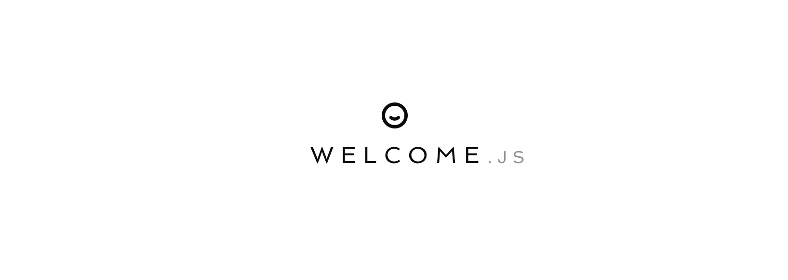

<div style="height:100px"></div>

# About Welcome.js

Welcome is a widget that lives in the bottom corner of your site, helping users find information and support in an unobtrusive way.

Welcome has been designed for [UseProduct](https://www.useproduct.com) to provide a simple way to add a support menu to any site.


## Welcome in action

Here's a demo: **[welcome.useproduct.com](https://welcome.useproduct.com/)**

## Add Welcome to your site

To add Welcome to your site:

```html
<script src="https://unpkg.com/@useproduct/welcome/welcome.js"></script>
<script>
  welcome.init({
    items: [
      {
        label: "Help & support",
        href: "https://github.com/useproduct/welcome.js/issues",
      },
    ],
  });
</script>
```

More examples of how you can configure Welcome can be found in [/demo](/demo).

## Configuration

```javascript
const welcomeInitOptions = {
  items: [
    // Standard link option
    {
      label: "Help & support",
      href: "https://example.com/help",
    },
    // Open in new tab/window
    {
      label: "Contact us",
      href: "https://external.example.com/",
      target: "_blank",
    },
    // Divider
    {
      type: "divider",
    },
    // Subtle, muted styling
    {
      label: "Terms and conditions",
      href: "https://example.com/terms",
      isMuted: true,
    },
    // Custom events
    {
      label: "Live chat",
      onClick: function (event) {
        console.log("Custom logic");
      },
    },
  ],
  // Override core colors. CSS can be used but this is simpler
  colors: {
    ctaBackground: "#3b3d4e",
    ctaHoverBackground: "#777785",
    ctaText: "#fff",
    menuBackground: "#f1f1f1f",
    menuItemHoverBackground: "#f2f2f2",
    menuItemMutedText: "#91929c",
  },
};
```

You can programmatically control the opening & closing of the menu:

```javascript
welcome.open();
welcome.close();
```

## Tasks

- [x] Add hosted demo page
- [x] Add dividers
- [x] Add full options documentation to Readme
- [x] Add custom event trigger support for section items
- [x] Add tests
- [ ] ECMAScript module import support
- [ ] Improve demo page design (add favicon & more instructions)

## Developing locally

Looking to develop Welcome for contributing/forking, great! Just run:

```
yarn start
```

This should build and run a demo environment for you to test on http://localhost:1234/.

Check everything still works

```
yarn test
```

### Credits

- Logo graphic: [Reception by Tomi Triyana](https://thenounproject.com/icon/reception-3177734/)
- Screenshot background image: [Planet Volumes](https://unsplash.com/fr/@planetvolumes?utm_source=unsplash&utm_medium=referral&utm_content=creditCopyText)
